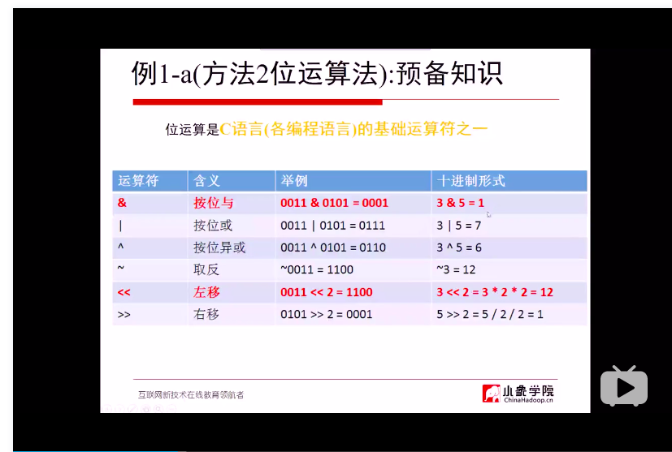

# Catalog

[TOC]


## greedy:

#### 455. Assign Cookies

#### 376. Wiggle Subsequence

#### 402. Remove K Digits 

本题最核心的部分是找到贪心算法的每次最优解。在第一遍练习时，找到了最优解的规律。但是没有想到使用栈来连续向前比较。

心得：

1. 当需要提高算法时间复杂度时，应该考虑引入栈，队列，集合等数据结构进行优化。
2. 对于双向链表的操作不熟悉。
3. 解贪心问题，画图，举例子非常重要
4. 审题一定要认真。

#### 55. Jump Game

#### 45. Jump Game II

```
Jump as far as possible but lazily.

[2, 3, 1, 1, 4]
i    nums[i]   steps   near   far
-      -         0       0     0
0      2         0       0     2
1      3         1       2     4
2      1         1       2     4
3      1         2       4     4
4      4         2       4     8
```

Time complexity: O(n)
Space complexity: O(1)

在O(n)的解法中，for循环既更新最大值，有在i大于 当前位置是进行计数。每次找每一段最开的

自己使用的O(n2)的算法，是因为需要用一个for循环记录每次最优的点。

#### 452. Minimum Number of Arrows to Burst Balloons

##### 此问题涉及到的知识点：

1. java如何表示负无穷
2. comparable 如何使用

java比较器系统学习

1. 多维数组排序

2. ```
   	Array.Sort(points, new Comparison<int[]>((a,b) => a[0]-b[0]));
   ```

3. java int 的最大最小值 [[-2147483648,2147483647]]

##### 错误记录：

未考虑负数，比较时初始值使用-1

#### 122. Best Time to Buy and Sell Stock II

#### 134. Gas Station

## 递归，回溯，分治

当问题每一步都有相同的解法时，就可以使用递归。

感觉回溯是多重的递归。

#### 704. Binary Search

#### 78. subsets

##### 位运算法


与运算的实质是该位存不存在。

位运算可以代表改位存不存在，逻辑&预算可以用来判断该位存不存在。

1<<多少位就可以代表第多少位。1<<多为用来生成总的代表存不存在的个数。

#### 90. Subsets II

1. 去重使用集合

2. 用集合去重时能不能相等可以用equal方法判断一下

3. 集合可以直接对arraylist去重

   

回溯法和位云算法的算法复杂度都是o(n2)

#### 40. Combination Sum II

生成子集的两种方法，位运算法，回溯法。

在使用两种方法，不进行剪枝的情况下，时间复杂度太差，使用回溯进行剪枝。

注意剪枝的条件，尽量去优化剪去不必要的分支。


#### 22. Generate Parentheses

1. 使用回溯时先实现不剪枝的方法，然后再剪枝
2. 使用return剪枝时，要注意后面分支还要不要执行
3. 在回溯中所有的操作都是对称的，删除后，回溯回来的时候要添加。
4. 只递归，不回溯的情况下就可以不进行删减操作
5. 剪枝的两条路径的两个if语句就相当于按照这两种情况进行遍历。
6. 有的问题是不需要回溯的，只需要递归就可以了，递归和回溯的区别就是需不需要把状态退回来。
7. 递归时直接在参数位置进行计算时，每次递归会自动copy当前值，每层递归都会保存一个值，所以不需要回退，如果使用一个引用，则需要回溯，在回退时，把修改的删除回来。

回溯问题解法：

1. 递归枚举所有
2. 使用条件语句剪枝
3. 回溯状态
4. 找到退出结果条件
5. 条件语句就是仅有的枚举分支


#### 51. N-Queens

做此问题时遇到两个问题：

1. 回溯过程中如何保存当前状态?自己在回退状态时出错。

   在每次递归增加临时变量，可以保存当前的状态。

2. 二维数组是引用，后续函数的会改变应用的值

   再次注意引用，后续函数的改变会改变引用的值。

3. 二维数组如何mark

   使用方向坐标对二维数组进行mark

4. 本问题的解决步骤

   1. 回溯
   2. 剪枝
      1. mark
      2. 回溯时回退状态


#### 315. Count of Smaller Numbers After Self

#### 169. Majority Element

注意return的是left和right

#### 53. Maximum Subarray

动态规划看后做

#### 215. Kth Largest Element in an Array

1. 第k大数下标位k-1
2. 最终返回的是下标所在位置的值


##    动态规划

#### 70. Climbing Stairs


#### 198. House Robber

注意边界测试

注意初始值

#### 53. Maximum Subarray


#### 322. Coin Change


1. 初始状态和状态转移方程要验证
2. 可以使用不可能值填充状态数组，然后只改变能够正确计算的状态，在判断状态的值，则可判定是否成功。。

3. 最大值使用一个不可能的值就可以了，不一定非要使用最大的正整数

#### 120. Triangle

#### 300. Longest Increasing Subsequence

1. 只要是选或者不选的问题，都可以使用位运算法去枚举
2. 状态转移方程中的前一种情况有可能是xuanqu
3. 枚举子序列转化为枚举以某个结尾的最长子序列

**未使用二分法**

#### 64. Minimum Path Sum

#### 174. Dungeon Game

正序不好计算时，需要考虑逆序。


### 二叉树

#### 113. Path S

#### 236. Lowest Common Ancestor of a Binary Tree

引用传递在函数内不要重新赋值

找两个链表的共同最小祖先直接从第一个开始遍历，找到最后一个相同的。


#### 114. Flatten Binary Tree to Linked List


#### 199. Binary Tree Right Side View

注意边界判断，注意判断空值


### 图

#### 207. Course Schedule

1. bool 是值传递
2. 递归也可以有返回值，使用bool返回值进行返回

做法：

        // 如果有环则说明失败。
        //1. 使用 List<List<>> 可以表示图。
        //2. 判断图有环， 深度优先遍历图，使用状态记录每个节点的状态，0.表示未遍历，1.表示正在遍历 2.表示该节点已被遍历  当正在遍历时再次被遍历，则表示有环。当发现有换时，整个函数返回
时间复杂度：O(n);


#### 二分查找

#### 35. Search Insert Position

1. 二分查找，当未找到时，i的位置就是插入位置。

#### 34. Find First and Last Position of Element in Sorted Array

1. 使用二分查找，修改二分查找的条件。 
2. 条件为：最左未：与target相等并且前一个元素小。 最右类似

总结：

1. 二分查找陈成功的条件是多样的，不止是 相等。
2. 没查找成功时缩小范围。

#### 33. Search in Rotated Sorted Array

1. 找到peak，使用二分查找，找peak时注意当mid为0的情况。
2. 分别二分查找
3. 注意空数组，注意边界条件

#### 二叉排序树

##### 449. Serialize and Deserialize BST

问题：如何在递归中累加字符串

使用stringbuilder

此题时间较慢，需要优化。

##### 315. Count of Smaller Numbers After Self

未做，后续继续学习


### hash

##### 409. Longest Palindrome

##### 290. Word Pattern

1. 长度不相等，false
2. char存在string不相等 false
3. string存在 char不存在，false

##### 49. Group Anagrams

1. 使用排序去除key的不同
2. 字符数组转字符串使用 String.valueof()
3. 不适用排序，而使用一个数组取编码k，可以优化


##### 3. Longest Substring Without Repeating Characters

1. map + 划窗
2. 求最大或最小值可以使用math.max每次统计

##### 187. Repeated DNA Sequences

写代码时先思路答题考虑好以后先考虑测试用例


##### 76. Minimum Window Substring


#### 搜索

1.如何把问题转换成搜索的问题？

##### 200.Number of Islands

1. dfs? bfs? 搜索所有连续的并标记
2. 遍历所有节点，使用并进行搜索
3. bfs时加入队列时就要标记，不然会导致重复加入

dfs和bfs 搜索都可以用来标记项链的东西

##### 127. Word Ladder

宽度优先搜索最先搜索道德就是最短的路径

1. 确定此问题是搜索问题
2. 求最小值，所以使用宽度有限搜索

宽度优先搜索加上层数，可以快速计算最小值

计算层数的两种方法：

1. 增加for循环
2. 定义新的结构体增加层数字段

宽度优先搜索步骤：

1. 新建队列和visit状态set
2. 加入队列，并把visit状态置位true，防止重复加入
3. 弹出队列并判断
4. 宽度优先搜索求层数，可以增加一个for循环每次操作完该层的数量，然后level++；
5. 下一步字符的生成使用 char[] 通过变了 'a' - 'z'能大幅提过运行时间
6. 优化点：1. 不使用结构体存储level， 而使用for循环直接计算 2. 生成下一步字符串用字符数组，通过所有字母穷举

##### 126. Word Ladder II

广度优先搜索的visit状态是可以变形的，不一定是在set中存不存在。有可能是其它的可不可以访问的条件

没完成，后面继续调试

需增加条件，使用map记录层数，同一层的需要继续访问

需要使用深度优先搜索进行统计结果


##### 473. Matchsticks to Square

1. 如何表示在四个地方摆

   设置四个桶，每次尝试往桶里面扔

2. 其实先扔哪个都是可以的
3. 全部回溯完不成功则退出
4. 回溯时判断一下是否顺序有关

回溯问题解法

1. 如何表示

2. 每次回溯的运算是什么 

   找一个桶放入数字

3. 回溯的遍历的是什么

   放入哪个桶

##### 407. Trapping Rain Water II


#### arrays

1. 遇到问题需要考虑边界情况
2. 很多数组问题都可以先进行排序再去解决
3. 数组问题 需要移动的或者删除的， 都可以用双指针去挪动元素。一个指针用来写结果，一个指针用来遍历

数组题可以通过画图解决

##### 26. Remove Duplicates from Sorted Array

1. 这个题可以扩展到删除一个数组中的重复元素，只要把其交换都数组开始的位置，就可以删除重复的。

**删除重复元素都可以使用移动的方式。**

2. 自己的做法：遍历数组，和前一个对比，不同则累加。相同则跳过

3. 标准答案：双指针,第一个指针指向结果位，第二个指针进行后续的遍历，不同这结果指针+1，并赋值

##### 80. Remove Duplicates from Sorted Array II

1. 同样使用双指针，但是在不同时需要检查下一个是否相同，相同则移动到初始位置。
2. 注意重复元素要特殊处理

##### Best Time to Buy and Sell Stock II

1. 自己的做法：

无股票时统计只要上涨就买入，下跌就卖出。

**注意，有无股票需要用-1标记，因为有可能有0的股票。**

2. 最优化做法：

   仅需要统计所有上涨的点就可以了，每个位置的数字与前一个对比，只要大于前一个，就累加入结果队列

##### Rotate Array

1. 自己的做法：利用额外空间。遇到的问题，未考虑边界情况，导致数组越界
2. 答案：使用reverse的方法，进行三次reverse，空间复杂度未o(1)；

##### Contains Duplicate

1. 自己的做法：使用set，查看重复。o(n) 0(n)
2. 也可以使用排序，然后检查相邻的是否重复。o(nlogn) o(1)

扩展：去重类似的问题，都可以考虑使用排序后处理

##### Single Number

1. 自己的做法：位运算 最优
2. 其它做法：使用 hashSet统计，有存在的就删除

##### Intersection of Two Arrays II

1. 先排序，然后使用两个指针操作
2. 使用集合

##### Move Zeroes

使用 双指针将不是0的元素全部挪到前面，然后给后面的值赋值